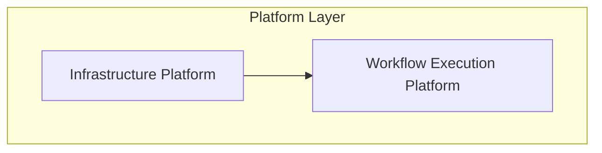
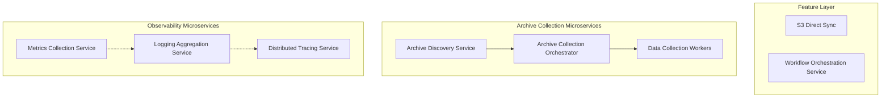

# Feature Interdependency Specifications
# Modular Architecture Integration Map | Version 1.0.0 (MODULAR)
# ================================================================

## 📋 Overview

This document defines the comprehensive interdependency specifications for the modularized feature architecture. Following the decomposition of complex features into focused, layered components, this mapping ensures proper integration patterns and dependency management across the entire platform.

**Architecture Status**: ✅ **MODULAR AND LAYERED**  
**Decomposition**: Complex features successfully split into 15 focused components  
**Last Updated**: July 24, 2025

## 🏗️ Modular Architecture Layers

### Platform Layer (Infrastructure & Shared Services)


### Feature Layer (Business Logic & Domain Services)


## 🔗 Comprehensive Dependency Matrix

### Platform Layer Dependencies

#### Infrastructure Platform
```yaml
dependencies:
  external_systems:
    - kubernetes_cluster: "Container orchestration and resource management"
    - aws_s3: "Object storage for data and artifacts"
    - postgresql: "Metadata and configuration storage"
    - redis: "Distributed caching and state management"
  
  provides_to:
    - workflow_execution_platform: "Storage APIs, orchestration runtime, messaging"
    - s3_direct_sync: "S3 operations, Prefect orchestration, MinIO storage"
    - metrics_collection_service: "Platform metrics, storage APIs"
    - logging_aggregation_service: "Platform logging, storage APIs"
    - distributed_tracing_service: "Platform tracing, storage APIs"

  integration_patterns:
    - shared_storage: "Common S3 and MinIO storage access"
    - unified_messaging: "Kafka event streaming backbone"
    - orchestration_runtime: "Prefect workflow execution environment"
```

#### Workflow Execution Platform
```yaml
dependencies:
  platform_dependencies:
    - infrastructure_platform: "Storage APIs, messaging, orchestration runtime"
  
  provides_to:
    - workflow_orchestration_service: "Execution APIs, resource management, state APIs"
    - archive_collection_orchestrator: "Workflow execution for collection coordination"
    - data_processing_pipelines: "Distributed processing execution"

  integration_patterns:
    - execution_abstraction: "Container orchestration abstraction layer"
    - resource_management: "Dynamic resource allocation and scaling"
    - state_coordination: "Distributed state management APIs"
```

### Feature Layer Dependencies

#### S3 Direct Sync
```yaml
dependencies:
  platform_dependencies:
    - infrastructure_platform: "S3 operations, Prefect orchestration, MinIO storage"
  
  provides_to:
    - archive_collection_orchestrator: "High-performance data transfer capabilities"
    - data_processing_pipeline: "Optimized data movement operations"
    - workflow_orchestration_service: "S3 transfer task integration"

  consumes_from:
    - metrics_collection_service: "Transfer performance metrics"
    - distributed_tracing_service: "Transfer operation tracing"
    - logging_aggregation_service: "Transfer operation logging"

  integration_patterns:
    - performance_optimization: "60%+ faster transfers through direct S3 operations"
    - monitoring_integration: "Complete observability for transfer operations"
    - workflow_integration: "Task-based integration with orchestration systems"
```

#### Archive Collection Microservices

##### Archive Discovery Service
```yaml
dependencies:
  platform_dependencies:
    - infrastructure_platform: "Storage APIs, messaging, runtime environment"
  
  provides_to:
    - archive_collection_orchestrator: "Discovery events, catalog data"
    - data_collection_workers: "Archive metadata for collection targeting"

  consumes_from:
    - metrics_collection_service: "Discovery performance metrics"
    - logging_aggregation_service: "Discovery operation logging"

  integration_patterns:
    - event_publishing: "Archive discovery events to coordination layer"
    - catalog_management: "Centralized archive metadata catalog"
    - source_monitoring: "Continuous monitoring of data source availability"
```

##### Archive Collection Orchestrator
```yaml
dependencies:
  platform_dependencies:
    - infrastructure_platform: "Messaging, storage APIs"
    - workflow_execution_platform: "Workflow execution APIs, resource management"
  
  feature_dependencies:
    - archive_discovery_service: "Discovery events, catalog queries"
    - s3_direct_sync: "High-performance data transfer operations"

  provides_to:
    - data_collection_workers: "Collection task assignment, coordination"

  consumes_from:
    - metrics_collection_service: "Orchestration performance metrics"
    - distributed_tracing_service: "Collection workflow tracing"

  integration_patterns:
    - saga_orchestration: "Long-running workflow coordination with compensation"
    - event_driven_coordination: "React to discovery events and coordinate collection"
    - resource_optimization: "Intelligent worker allocation and load balancing"
```

##### Data Collection Workers
```yaml
dependencies:
  platform_dependencies:
    - infrastructure_platform: "Storage APIs, runtime environment"
  
  feature_dependencies:
    - archive_collection_orchestrator: "Task assignments, coordination commands"
    - archive_discovery_service: "Archive metadata and collection targets"

  consumes_from:
    - distributed_tracing_service: "Collection operation tracing"
    - logging_aggregation_service: "Collection operation logging"

  integration_patterns:
    - worker_pool: "Horizontally scalable competing consumers pattern"
    - fault_isolation: "Independent worker failure tolerance"
    - stateless_execution: "Stateless workers with temporary processing storage"
```

#### Observability Microservices

##### Metrics Collection Service
```yaml
dependencies:
  platform_dependencies:
    - infrastructure_platform: "Storage APIs, runtime environment"
  
  provides_to:
    - ALL_SERVICES: "Metrics collection and performance monitoring"

  consumes_from:
    - logging_aggregation_service: "Log-based metrics extraction"
    - distributed_tracing_service: "Trace-based performance metrics"

  integration_patterns:
    - metrics_aggregation: "Time-series data collection and processing"
    - prometheus_integration: "Prometheus-compatible metrics exposition"
    - alerting_integration: "Metrics-based alerting and threshold management"
```

##### Logging Aggregation Service
```yaml
dependencies:
  platform_dependencies:
    - infrastructure_platform: "Storage APIs, runtime environment"
  
  provides_to:
    - ALL_SERVICES: "Centralized logging and log analysis"
    - metrics_collection_service: "Log-based metrics extraction"

  consumes_from:
    - distributed_tracing_service: "Trace-log correlation"

  integration_patterns:
    - log_aggregation: "Multi-source log collection and processing"
    - structured_logging: "Standardized log formats across platform"
    - correlation_support: "Log-trace correlation with context IDs"
```

##### Distributed Tracing Service
```yaml
dependencies:
  platform_dependencies:
    - infrastructure_platform: "Storage APIs, runtime environment"
  
  provides_to:
    - ALL_SERVICES: "Distributed tracing and performance analysis"
    - metrics_collection_service: "Trace-based performance metrics"
    - logging_aggregation_service: "Trace-log correlation"

  integration_patterns:
    - opentelemetry_standard: "OpenTelemetry-based distributed tracing"
    - service_dependency_mapping: "Automatic service relationship discovery"
    - performance_analysis: "Request flow and bottleneck identification"
```

#### Workflow Orchestration Service
```yaml
dependencies:
  platform_dependencies:
    - workflow_execution_platform: "Execution APIs, resource management, state APIs"
  
  feature_dependencies:
    - s3_direct_sync: "S3 transfer task integration"
    - archive_collection_orchestrator: "Collection workflow coordination"

  consumes_from:
    - metrics_collection_service: "Workflow performance metrics"
    - distributed_tracing_service: "Workflow execution tracing"
    - logging_aggregation_service: "Workflow operation logging"

  integration_patterns:
    - prefect_integration: "Prefect 2.0-based workflow orchestration"
    - developer_experience: "Python-native workflow development"
    - intelligent_scheduling: "Business logic and priority-aware scheduling"
```

## 📊 Cross-Feature Integration Patterns

### Data Flow Integration
```yaml
archive_collection_flow:
  1. archive_discovery_service: "Discovers new archives and publishes events"
  2. archive_collection_orchestrator: "Receives events and creates collection workflows"
  3. workflow_orchestration_service: "Executes collection workflows using platform"
  4. data_collection_workers: "Execute collection tasks using S3 Direct Sync"
  5. observability_services: "Monitor and track entire collection pipeline"

data_processing_flow:
  1. workflow_orchestration_service: "Orchestrates complex data processing pipelines"
  2. workflow_execution_platform: "Provides execution infrastructure and resources"
  3. s3_direct_sync: "Optimizes data movement between processing stages"
  4. observability_services: "Provide end-to-end processing visibility"

monitoring_flow:
  1. ALL_SERVICES: "Generate telemetry (metrics, logs, traces)"
  2. metrics_collection_service: "Collect and aggregate performance metrics"
  3. logging_aggregation_service: "Aggregate and correlate logs"
  4. distributed_tracing_service: "Trace request flows and dependencies"
  5. unified_dashboards: "Present correlated observability data"
```

### Event-Driven Coordination
```yaml
event_backbone:
  platform: "Infrastructure Platform Kafka messaging"
  
event_patterns:
  - archive_discovered: "Discovery → Orchestrator → Workers"
  - collection_completed: "Workers → Orchestrator → Metrics"
  - workflow_triggered: "Orchestrator → Execution Platform → Tracing"
  - resource_exhausted: "Platform → Orchestrator → Scaling"
  - performance_degraded: "Metrics → Alerting → Operations"

coordination_patterns:
  - saga_pattern: "Archive Collection Orchestrator coordinates long-running workflows"
  - event_sourcing: "Workflow Orchestration Service maintains complete audit trail"
  - circuit_breaker: "All services implement circuit breaker for dependency failures"
  - bulkhead_isolation: "Resource isolation between different workflow types"
```

### API Integration Matrix
```yaml
platform_apis:
  infrastructure_platform:
    - storage_api: "Used by all services for data persistence"
    - messaging_api: "Used for event-driven coordination"
    - orchestration_api: "Used for workflow execution"
  
  workflow_execution_platform:
    - execution_api: "Used by Workflow Orchestration Service"
    - resource_api: "Used for dynamic resource allocation"
    - state_api: "Used for distributed state management"

feature_apis:
  s3_direct_sync:
    - transfer_api: "Used by Archive Collection and Data Processing"
    
  observability_services:
    - metrics_api: "Used by all services for performance monitoring"
    - logging_api: "Used by all services for centralized logging"
    - tracing_api: "Used by all services for distributed tracing"

external_apis:
  - exchange_apis: "Used by Archive Discovery Service"
  - kubernetes_api: "Used by Workflow Execution Platform"
  - prometheus_api: "Used by Metrics Collection Service"
```

## 🎯 Integration Quality Targets

### Performance Targets
```yaml
cross_service_latency:
  - service_to_service: "< 100ms API calls (95th percentile)"
  - event_propagation: "< 5 seconds end-to-end event processing"
  - data_flow: "< 30 seconds for complete archive collection workflow"

throughput_targets:
  - concurrent_workflows: "1000+ simultaneous workflows across all services"
  - event_processing: "10K+ events/second through platform backbone"
  - data_transfer: "10TB+ daily through S3 Direct Sync integration"

reliability_targets:
  - service_availability: "99.9% availability for all critical path services"
  - fault_tolerance: "Single service failure isolation with graceful degradation"
  - data_consistency: "100% consistency for workflow state and coordination"
```

### Monitoring and Alerting
```yaml
integration_monitoring:
  - dependency_health: "Monitor health of all service dependencies"
  - api_performance: "Track API latency and error rates between services"
  - event_flow: "Monitor event processing latency and success rates"
  - resource_utilization: "Track cross-service resource usage and optimization"

alerting_patterns:
  - cascade_prevention: "Prevent alert storms during multi-service issues"
  - root_cause_correlation: "Correlate alerts across service boundaries"
  - escalation_routing: "Route alerts based on service ownership and expertise"
  - context_enrichment: "Enrich alerts with cross-service context and dependencies"
```

## 🚀 Migration and Deployment Strategy

### Deployment Dependencies
```yaml
deployment_order:
  phase_1_platform:
    1. infrastructure_platform: "Core platform infrastructure"
    2. workflow_execution_platform: "Execution infrastructure layer"
  
  phase_2_observability:
    3. metrics_collection_service: "Metrics collection and monitoring"
    4. logging_aggregation_service: "Centralized logging"
    5. distributed_tracing_service: "Distributed tracing"
  
  phase_3_features:
    6. s3_direct_sync: "High-performance data transfer"
    7. archive_discovery_service: "Archive discovery and cataloging"
    8. archive_collection_orchestrator: "Collection coordination"
    9. data_collection_workers: "Collection execution"
    10. workflow_orchestration_service: "High-level workflow management"

integration_testing:
  - service_isolation: "Test each service in isolation with mocked dependencies"
  - integration_testing: "Test service pairs and dependency chains"
  - end_to_end_testing: "Test complete workflows across all services"
  - chaos_engineering: "Test fault tolerance and recovery patterns"
```

### Configuration Management
```yaml
configuration_hierarchy:
  platform_config:
    - infrastructure_platform: "Storage, messaging, orchestration configuration"
    - workflow_execution_platform: "Execution policies, resource limits"
  
  service_config:
    - feature_services: "Service-specific configuration and tuning"
    - observability_services: "Monitoring, logging, and tracing configuration"
  
  integration_config:
    - service_discovery: "Service endpoint and dependency configuration"
    - security_policies: "Authentication, authorization, and audit configuration"
    - performance_tuning: "Cross-service performance optimization settings"
```

---

**🔗 Modular Integration | 📊 15 Focused Components | 🎯 Dependency Management | 🚀 Layered Architecture**

**Documentation Version**: 1.0.0  
**Architecture Status**: ✅ Complete modular decomposition with comprehensive interdependencies  
**Last Updated**: July 24, 2025